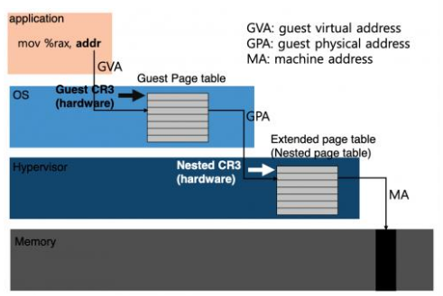
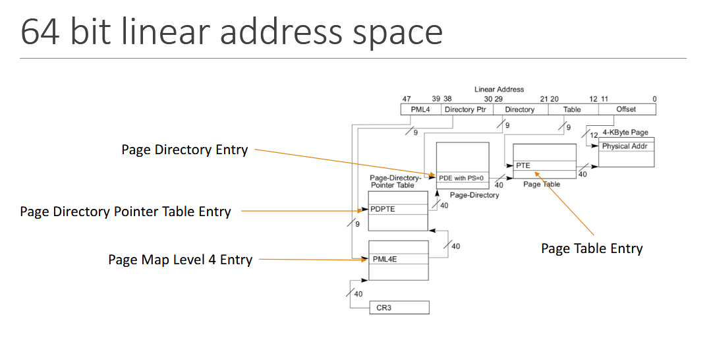

# PageWalkProject-VM

## Extended Page Tables:
- *Extended page tables* combine in hardware the classic hardware-defined page table structure of the x86, maintained by the guest OS with a second page table structure maintained by the hypervisor which specifies guest-physical to host-physical mappings.
- The *Extended Page Table Pointer (EPTP)* is a table that points into the extended page (host memory).

## Address Path:
Guest Virtual -> Guest Physical -> Host Physical

## Command Line Test Cases
`python3 input.py 0x535385a4871e43d1 0x4e23af5972197578 ept_tables.csv 0x0000EF0123456789`
- Result: 0x1a49a56db789

`python3 input.py 0x19073eeae45f123d 0x92a8945bf43d8e5e ept_tables2.csv 0xe8725a5c4b0e3d2c`
- Result: 0x74cdb6a25971ad2c